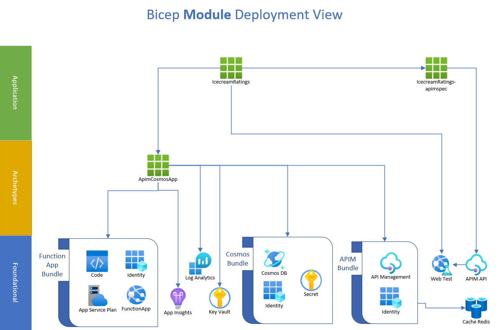
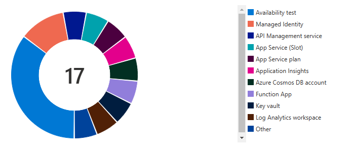
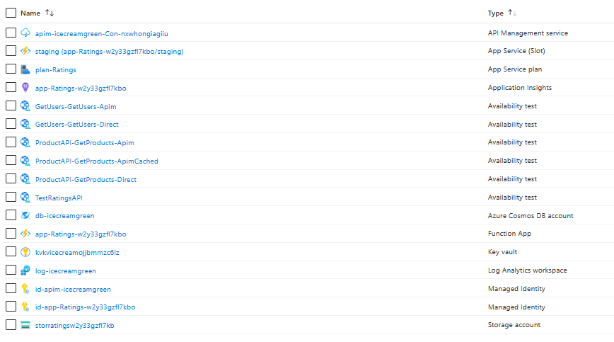

# Serverless App Stack

## Objective

The point of this repo is to productionise a common application pattern.

Through creating the "best" use of Bicep Modules, an archetype has been created that can easily be leveraged by other similar applications.

## The layers

The modules have been structured in 3 layers

1. Foundational
1. Archetype
1. Application

### Foundational

Foundational bicep modules are opinionated in the configuration that best suits your enterprise. They are not simple modules that expose every possible value for every resource type. Foundational modules are precise, and often deploy more than one resource where they need to be tightly bound (bundles).

### Archetype

Archetypes fulfill a use case without being application specifc. They integrate disparate Azure services that should be leveraged together to create a new module that is simple to deploy and easy for your application teams to leverage.

### Application

These modules are totally specific to your application or enterprise function. They decide names, they provide source code, they configure empty infrastructure to something meaningful.

## View of the bicep modules



## The main components

```text
APIM -> FunctionApp -> CosmosDb
```

## Diagram view of all components




